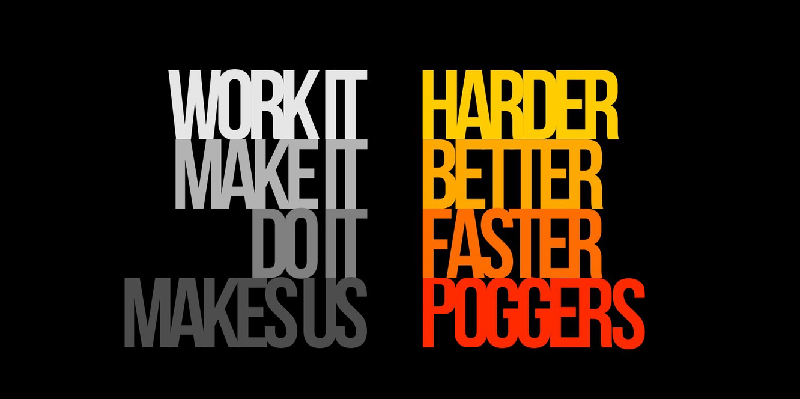
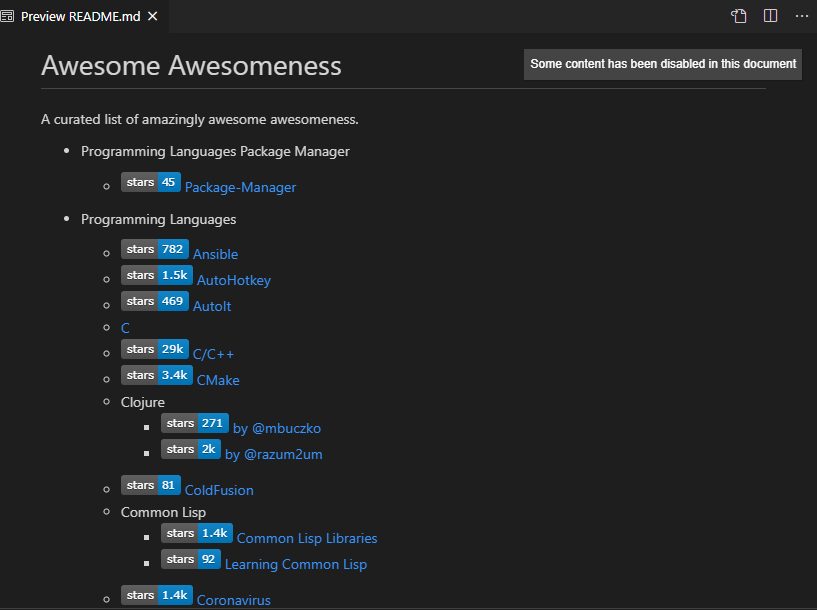

<!-- PROJECT LOGO -->
 

  
  
Harder, Better, Faster, Poggers

  <h2 align="center">Awesome List with Badges</h2>

  

    Do you hate it when you click on a repo, and realise "hey, what the hell? why am i working with this? this has like less than 50 stars"
  

  

    Same, I always feel the same way when I see my own repos
  

<!-- ABOUT THE PROJECT -->
## Introducing Awesome With Badges

  

Now you can discriminate repos by stars, ensuring my repos (with less than 50 stars) will never see the light of day.

<!-- USAGE EXAMPLES -->
## Why was this built?

everyone says "hey, just learn all the stuff, youre a cs student with 4 years, so much time!"

yeah then i see a whole ass awesome list with more than 60 different techstacks, frameworks, libraries, multiply with the 100+ different lists.

are you like me, a peasant human bean with a measly piss-poor short lifespan of only 85 years?

then heres a awesome list with star counts to save you time

all repos are built equal - some more equal than others

## Built With

my straightup poor python skills

<!-- GETTING STARTED -->
## FAQ

Q: but but, this is discrimatory against repos with smaller number of stars that might be good as well!

A: yeah, like all my other repos

Q: i have a personal question

A: lets keep it that way

<!-- ROADMAP -->
## Roadmap

actually want to automate this using github actions, wow? a ci/cd idea that isn't trash? holy shit

<!-- ACKNOWLEDGEMENTS -->
## Acknowledgements

but on a serious note, great thanks to all the maintainers of these awesome lists