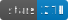
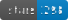

  
  
"i only date people with repos that have > 1k stars"

  <h2 align="center">onurakpolat/awesome-analytics</h2>

<table style="max-width:100%;table-layout:auto;">  <tr style="text-align:center;">
        <th>Repo Name</th>
        <th>Links</th>
        <th>Description</th>
        <th>Stars</th>
    </tr><!-- ** awesome -->
    <tr>
        <td rowspan="2"><b>

awesome

</b></td>
        <td rowspan="2"><a href="https://github.com/sindresorhus/awesome">original</a></td>
        <td rowspan="2">Awesome</a></td>
        <td rowspan="2"></td>
    </tr>
    <tr>
    </tr>
    <!-- ** incubator-superset -->
    <tr>
        <td rowspan="2"><b>

incubator-superset

</b></td>
        <td rowspan="2"><a href="https://github.com/apache/incubator-superset">original</a></td>
        <td rowspan="2">Source Code</a></td>
        <td rowspan="2"></td>
    </tr>
    <tr>
    </tr>
    <!-- ** awesome-awesomeness -->
    <tr>
        <td rowspan="2"><b>

awesome-awesomeness

</b></td>
        <td rowspan="2"><a href="https://github.com/bayandin/awesome-awesomeness">original</a></td>
        <td rowspan="2">awesome-awesomeness</a></td>
        <td rowspan="2"></td>
    </tr>
    <tr>
    </tr>
    <!-- ** metabase -->
    <tr>
        <td rowspan="2"><b>

metabase

</b></td>
        <td rowspan="2"><a href="https://github.com/metabase/metabase">original</a></td>
        <td rowspan="2">Source Code</a></td>
        <td rowspan="2"></td>
    </tr>
    <tr>
    </tr>
    <!-- ** redash -->
    <tr>
        <td rowspan="2"><b>

redash

</b></td>
        <td rowspan="2"><a href="https://github.com/getredash/redash">original</a></td>
        <td rowspan="2">Source Code</a></td>
        <td rowspan="2"></td>
    </tr>
    <tr>
    </tr>
    <!-- ** goaccess -->
    <tr>
        <td rowspan="2"><b>

goaccess

</b></td>
        <td rowspan="2"><a href="https://github.com/allinurl/goaccess">original</a></td>
        <td rowspan="2">Source Code</a></td>
        <td rowspan="2"></td>
    </tr>
    <tr>
    </tr>
    <!-- ** druid -->
    <tr>
        <td rowspan="2"><b>

druid

</b></td>
        <td rowspan="2"><a href="https://github.com/druid-io/druid">original</a></td>
        <td rowspan="2">Source Code</a></td>
        <td rowspan="2"></td>
    </tr>
    <tr>
    </tr>
    <!-- ** awesome-bigdata -->
    <tr>
        <td rowspan="2"><b>

awesome-bigdata

</b></td>
        <td rowspan="2"><a href="https://github.com/onurakpolat/awesome-bigdata">original</a></td>
        <td rowspan="2">awesome-bigdata</a></td>
        <td rowspan="2"></td>
    </tr>
    <tr>
    </tr>
    <!-- ** lists -->
    <tr>
        <td rowspan="2"><b>

lists

</b></td>
        <td rowspan="2"><a href="https://github.com/jnv/lists">original</a></td>
        <td rowspan="2">list</a></td>
        <td rowspan="2"></td>
    </tr>
    <tr>
    </tr>
    <!-- ** freeboard -->
    <tr>
        <td rowspan="2"><b>

freeboard

</b></td>
        <td rowspan="2"><a href="https://github.com/Freeboard/freeboard">original</a></td>
        <td rowspan="2">Freeboard</a></td>
        <td rowspan="2"></td>
    </tr>
    <tr>
    </tr>
    <!-- ** umami -->
    <tr>
        <td rowspan="2"><b>

umami

</b></td>
        <td rowspan="2"><a href="https://github.com/mikecao/umami">original</a></td>
        <td rowspan="2">Source Code</a></td>
        <td rowspan="2"></td>
    </tr>
    <tr>
    </tr>
    <!-- ** plausible -->
    <tr>
        <td rowspan="2"><b>

plausible

</b></td>
        <td rowspan="2"><a href="https://github.com/plausible-insights/plausible">original</a></td>
        <td rowspan="2">open source</a></td>
        <td rowspan="2"></td>
    </tr>
    <tr>
    </tr>
    <!-- ** analytics -->
    <tr>
        <td rowspan="2"><b>

analytics

</b></td>
        <td rowspan="2"><a href="https://github.com/plausible/analytics">original</a></td>
        <td rowspan="2">Source Code</a></td>
        <td rowspan="2"></td>
    </tr>
    <tr>
    </tr>
    <!-- ** posthog -->
    <tr>
        <td rowspan="2"><b>

posthog

</b></td>
        <td rowspan="2"><a href="https://github.com/posthog/posthog">original</a></td>
        <td rowspan="2">Source Code</a></td>
        <td rowspan="2"></td>
    </tr>
    <tr>
    </tr>
    <!-- ** rudder-server -->
    <tr>
        <td rowspan="2"><b>

rudder-server

</b></td>
        <td rowspan="2"><a href="https://github.com/rudderlabs/rudder-server">original</a></td>
        <td rowspan="2">Source Code</a></td>
        <td rowspan="2"></td>
    </tr>
    <tr>
    </tr>
    <!-- ** Ackee -->
    <tr>
        <td rowspan="2"><b>

Ackee

</b></td>
        <td rowspan="2"><a href="https://github.com/electerious/Ackee">original</a></td>
        <td rowspan="2">Source Code</a></td>
        <td rowspan="2"></td>
    </tr>
    <tr>
    </tr>
    <!-- ** goatcounter -->
    <tr>
        <td rowspan="2"><b>

goatcounter

</b></td>
        <td rowspan="2"><a href="https://github.com/zgoat/goatcounter">original</a></td>
        <td rowspan="2">Source Code</a></td>
        <td rowspan="2"></td>
    </tr>
    <tr>
    </tr>
    <!-- ** awesome-awesome-awesome -->
    <tr>
        <td rowspan="2"><b>

awesome-awesome-awesome

</b></td>
        <td rowspan="2"><a href="https://github.com/t3chnoboy/awesome-awesome-awesome">original</a></td>
        <td rowspan="2">awesome-awesome-awesome</a></td>
        <td rowspan="2"></td>
    </tr>
    <tr>
    </tr>
    <!-- ** Open-Web-Analytics -->
    <tr>
        <td rowspan="2"><b>

Open-Web-Analytics

</b></td>
        <td rowspan="2"><a href="https://github.com/padams/Open-Web-Analytics">original</a></td>
        <td rowspan="2">Source Code</a></td>
        <td rowspan="2"></td>
    </tr>
    <tr>
    </tr>
    <!-- ** shynet -->
    <tr>
        <td rowspan="2"><b>

shynet

</b></td>
        <td rowspan="2"><a href="https://github.com/milesmcc/shynet">original</a></td>
        <td rowspan="2">Shynet</a></td>
        <td rowspan="2"></td>
    </tr>
    <tr>
    </tr>
    <!-- ** rakam -->
    <tr>
        <td rowspan="2"><b>

rakam

</b></td>
        <td rowspan="2"><a href="https://github.com/rakam-io/rakam">original</a></td>
        <td rowspan="2">Source Code</a></td>
        <td rowspan="2"></td>
    </tr>
    <tr>
    </tr>
    <!-- ** serposcope -->
    <tr>
        <td rowspan="2"><b>

serposcope

</b></td>
        <td rowspan="2"><a href="https://github.com/serphacker/serposcope">original</a></td>
        <td rowspan="2">Source Code</a></td>
        <td rowspan="2"></td>
    </tr>
    <tr>
    </tr>
    <!-- ** Socioboard-4.0 -->
    <tr>
        <td rowspan="2"><b>

Socioboard-4.0

</b></td>
        <td rowspan="2"><a href="https://github.com/socioboard/Socioboard-4.0">original</a></td>
        <td rowspan="2">Source Code</a></td>
        <td rowspan="2"></td>
    </tr>
    <tr>
    </tr>
    <!-- ** offen -->
    <tr>
        <td rowspan="2"><b>

offen

</b></td>
        <td rowspan="2"><a href="https://github.com/offen/offen">original</a></td>
        <td rowspan="2">Source Code</a></td>
        <td rowspan="2"></td>
    </tr>
    <tr>
    </tr>
    <!-- ** freshlytics -->
    <tr>
        <td rowspan="2"><b>

freshlytics

</b></td>
        <td rowspan="2"><a href="https://github.com/sheshbabu/freshlytics">original</a></td>
        <td rowspan="2">Freshlytics</a></td>
        <td rowspan="2"></td>
    </tr>
    <tr>
    </tr>
    <!-- ** koko-analytics -->
    <tr>
        <td rowspan="2"><b>

koko-analytics

</b></td>
        <td rowspan="2"><a href="https://github.com/ibericode/koko-analytics">original</a></td>
        <td rowspan="2">Source Code</a></td>
        <td rowspan="2"></td>
    </tr>
    <tr>
    </tr>
    <!-- ** awstats -->
    <tr>
        <td rowspan="2"><b>

awstats

</b></td>
        <td rowspan="2"><a href="https://github.com/eldy/awstats">original</a></td>
        <td rowspan="2">Source Code</a></td>
        <td rowspan="2"></td>
    </tr>
    <tr>
    </tr>
    <!-- ** chartbrew -->
    <tr>
        <td rowspan="2"><b>

chartbrew

</b></td>
        <td rowspan="2"><a href="https://github.com/chartbrew/chartbrew">original</a></td>
        <td rowspan="2">Source Code</a></td>
        <td rowspan="2"></td>
    </tr>
    <tr>
    </tr>
    <!-- ** kis3 -->
    <tr>
        <td rowspan="2"><b>

kis3

</b></td>
        <td rowspan="2"><a href="https://github.com/kis3/kis3">original</a></td>
        <td rowspan="2">Source Code</a></td>
        <td rowspan="2"></td>
    </tr>
    <tr>
    </tr>
    <!-- ** kindmetrics -->
    <tr>
        <td rowspan="2"><b>

kindmetrics

</b></td>
        <td rowspan="2"><a href="https://github.com/kindmetrics/kindmetrics">original</a></td>
        <td rowspan="2">Source Code</a></td>
        <td rowspan="2"></td>
    </tr>
    <tr>
    </tr>
    </table>